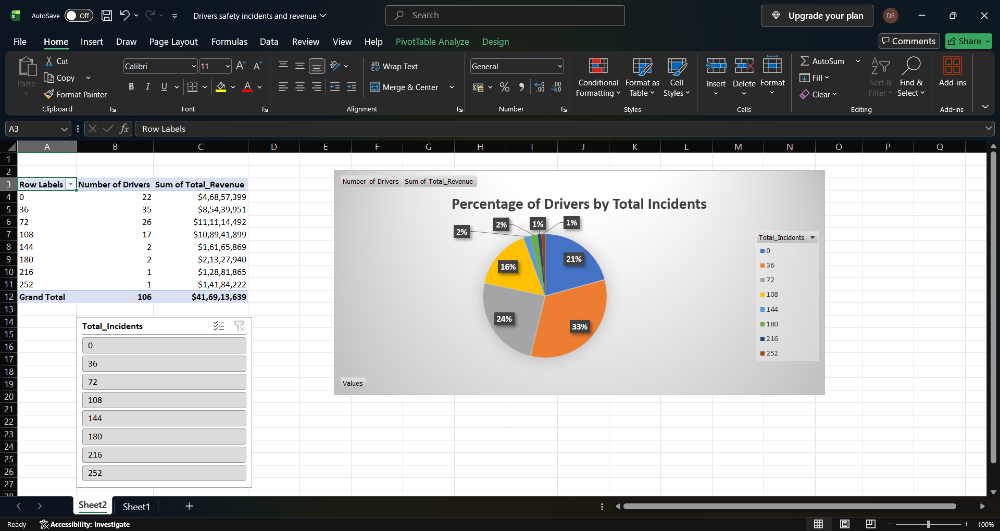

# Project 4: Driver Safety Dashboard (Excel)

## Supply Chain Risk & Revenue Visualization

### Business Impact
Visualizing driver incident distribution and revenue impact allows logistics managers to quickly identify risk concentrations and allocate safety training budgets effectively. This dashboard supports data-driven decision-making for fleet operations and highlights the financial trade-offs associated with high-risk, high-reward drivers.

### Project Goal
Create an interactive Excel dashboard to analyze the percentage of drivers in each incident bracket and the total revenue they generate.

### Dataset
- **Source:** Kaggle (Driver Performance Logistics Dataset)
- **Data File:** `Project4_Driver_Dashboard.xlsx`

### Tools Used
- Microsoft Excel
- PivotTables
- PivotCharts (Pie Chart)
- Slicers

### Key Skills Demonstrated
- Data Visualization
- PivotTable Creation
- Dashboard Design
- Interactive Filtering (Slicers)
- Data Cleaning & Formatting

### Excel Dashboard Features
- **PivotTable:** Summarizes the count of drivers (`Number of Drivers`) and total revenue (`Sum of Total_Revenue`) grouped by `Total_Incidents`.
- **Pie Chart:** Visualizes the percentage of drivers in each incident bracket (e.g., 33% of drivers have 36 incidents).
- **Slicer:** Allows the user to interactively filter the dashboard by `Total_Incidents`.

### Outcome
Successfully transformed raw driver data into an interactive Excel dashboard. The visualizations reveal the distribution of drivers across different incident levels and highlight the revenue associated with each risk tier. This demonstrates the ability to translate database query results into a business intelligence tool.

### Key Findings (Top Results)

| Total Incidents | Number of Drivers | Total Revenue ($) |
| :--- | :--- | :--- |
| 36 | 35 | $8,54,39,951 |
| 72 | 26 | $11,11,14,492 |
| 0 | 22 | $4,68,57,399 |

*Note: Full dashboard output provided below and in `Project4.png`.*

### Key Insight
While **54%** of drivers fall into the lower incident brackets (0 and 36 incidents), the data reveals a clear risk-reward trade-off. A small minority of high-incident drivers (180 to 252 incidents) account for a disproportionate share of total revenue (over $41.6 Crore). This suggests that high-earning drivers may also be high-risk, requiring targeted safety interventions rather than outright replacement.

### Screenshot

